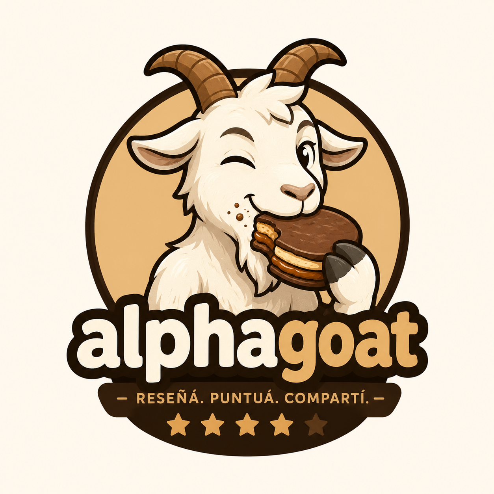
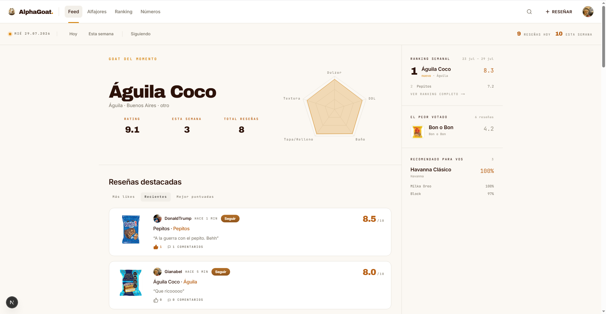
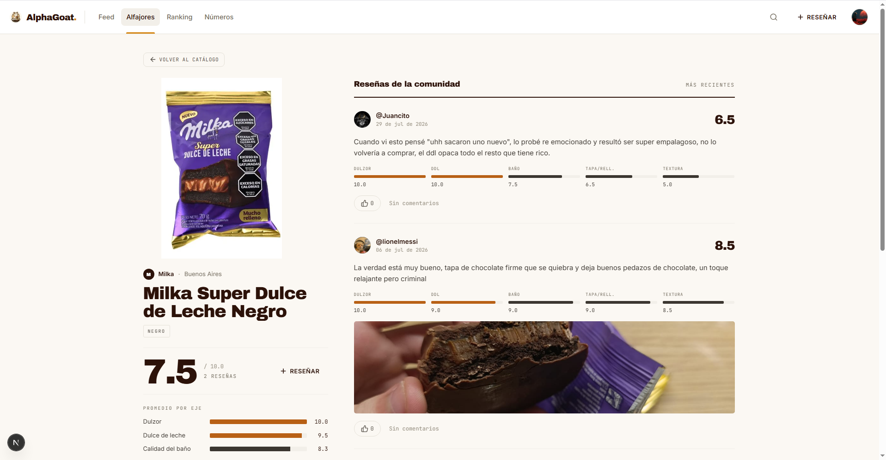
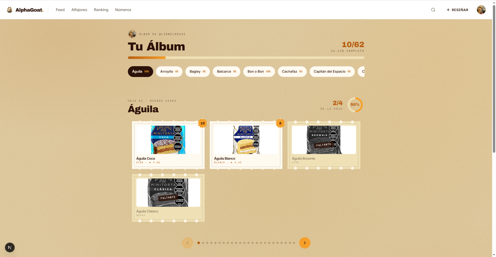
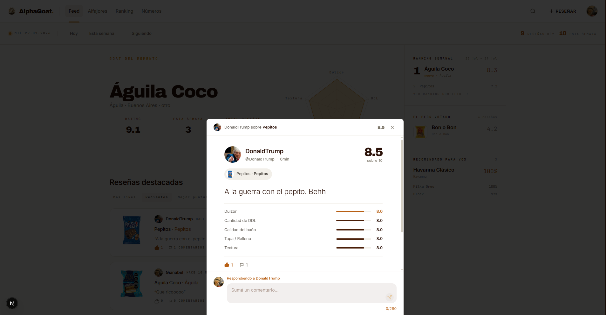
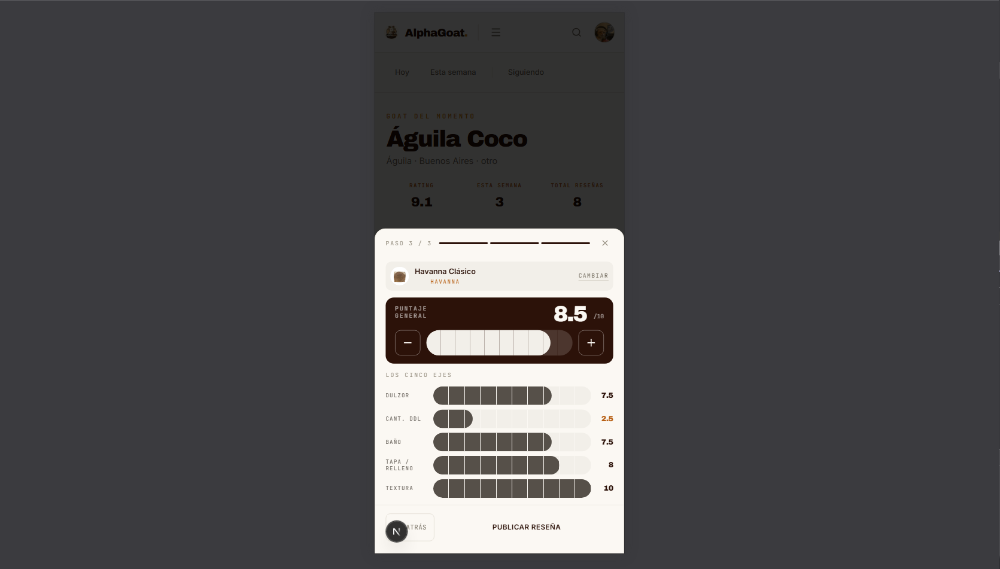

<div align="center">



# AlphaGoat

**Reviews, competencia y discusiones sobre el mercado de alfajores argentinos, y algunas cositas más**.

[](https://github.com/pulygarcia/alpha-goat-client/actions/workflows/ci.yml)


</div>



## Qué hace

- **Feed** con el alfajor destacado en radar y un rail editorial: top 3 del momento, el peor votado y recomendaciones por afinidad de paladar.
- **Ficha del alfajor** con el puntaje protagonista, el promedio de cada eje y las reseñas de la comunidad.
- **Reseñas** con foto opcional, comentarios y likes; seguís a otros usuarios y su actividad te llega al feed.
- **Rankings** global (histórico, con piso de 5 reseñas), semanal con tendencia y el peor votado.
- **Catálogo colaborativo**: cualquiera propone un alfajor — o una marca que no esté cargada — y un admin lo aprueba desde `/admin`.
- **Álbum de figuritas** por usuario: una hoja por marca, estampilla a color en las que reseñó, gris en las que le faltan.
- `/stats` con la cúpula 3D de la comunidad y los contadores globales.

<table>
<tr>
<td width="50%"><br /><sub><b>Ficha del alfajor</b> — puntaje protagonista y promedio por eje</sub></td>
<td width="50%"><br /><sub><b>Álbum</b> — una hoja por marca, gris en las que faltan</sub></td>
</tr>
<tr>
<td width="50%"><br /><sub><b>Reseña</b> — los cinco ejes y el hilo de comentarios</sub></td>
<td width="50%"><br /><sub><b>Reseñar</b> — wizard de tres pasos, pensado para el teléfono</sub></td>
</tr>
</table>

## Stack

| Capa               | Tecnología                                      |
| ------------------ | ----------------------------------------------- |
| Framework          | Next.js 16 (App Router, Server Components)      |
| Lenguaje           | TypeScript strict                               |
| Estilos            | Tailwind CSS v4 (tokens en `globals.css`)       |
| Primitivos UI      | shadcn/ui sobre Radix                           |
| Estado de servidor | TanStack Query                                  |
| Estado de cliente  | Zustand                                         |
| Formularios        | React Hook Form + Zod                           |
| Charts             | Recharts                                        |
| HTTP               | Axios (`withCredentials: true`)                 |
| Auth               | JWT en cookie HTTP-only que setea el back       |
| Testing            | Vitest + React Testing Library (coverage ≥ 85%) |
| Lint / Format      | ESLint + Prettier                               |

## Empezar

Requiere **Node 20+** y **pnpm** (el repo tiene un `preinstall` con `only-allow pnpm`: `npm install` falla a propósito).

```bash
cp .env.example .env.local      # apuntar a la URL del back
pnpm install
pnpm dev                        # http://localhost:3000
```

El backend ([alpha-goat-server](https://github.com/pulygarcia/alpha-goat-server), NestJS) tiene que estar corriendo en `http://localhost:3001`.

```env
NEXT_PUBLIC_API_URL=http://localhost:3001
```

## Scripts

| Comando              | Qué hace                                    |
| -------------------- | ------------------------------------------- |
| `pnpm dev`           | Dev server con HMR                          |
| `pnpm build`         | Build de producción                         |
| `pnpm start`         | Sirve el build                              |
| `pnpm test`          | Tests unitarios (Vitest)                    |
| `pnpm test:watch`    | Tests en watch                              |
| `pnpm test:coverage` | Coverage (threshold 85%)                    |
| `pnpm lint`          | ESLint                                      |
| `pnpm format`        | Prettier                                    |
| `pnpm format:check`  | Prettier en modo check (lo que corre en CI) |

## Estructura

```
src/
├── app/         # rutas (App Router) — páginas finitas que solo componen
├── features/    # cada feature con sus components/hooks/api/schemas/types
├── shared/      # reutilizable entre features (ui, lib, providers, hooks)
└── config/      # env, query-client
```

- **Feature-based**: una feature a la vez en `src/features/<nombre>/`. Lo que usan 2+ features se muda a `shared/`.
- **Server Components por default**; `'use client'` solo en el componente que lo necesita, no en el padre.
- **Nunca se llama a la API desde un componente**: siempre vía un hook (`useX`) que envuelve una función de `api/`.
- Ningún color literal en un componente: todo sale de los tokens de `globals.css`.

## Más info

- [`docs/architecture.md`](docs/architecture.md) — arquitectura detallada, ejemplos de feature.
- [`docs/design-guidelines.md`](docs/design-guidelines.md) — paleta, tipografía, tokens y utilidades.
- [`AGENTS.md`](AGENTS.md) — reglas del proyecto (es la fuente de verdad; `CLAUDE.md` solo la importa).
